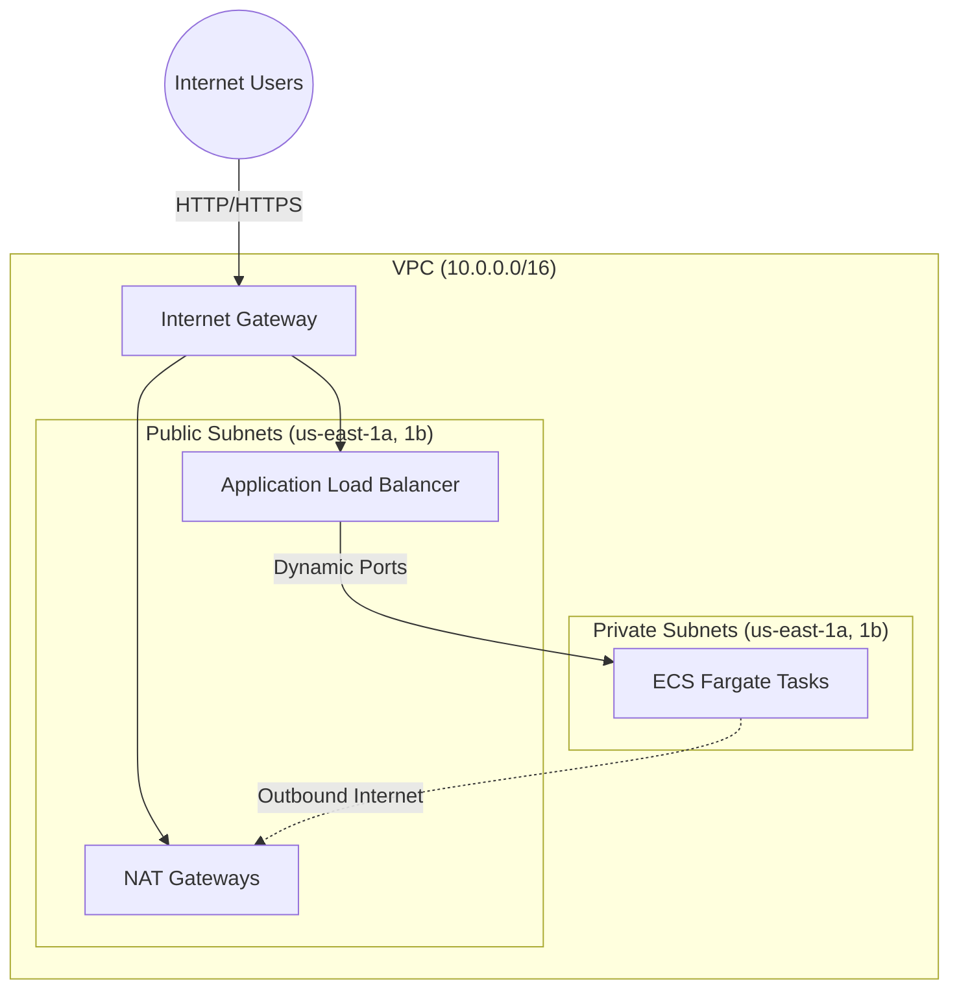

# AWS ECS Fargate Terraform Infrastructure

An industry-standard, modular Terraform project designed to provision a highly available AWS ECS Fargate application. The infrastructure is segmented into multiple isolated environments (`dev`, `staging`, `prod`) to enable safe progression and testing of infrastructure changes.

## Architecture

This project implements a secure, highly-available architecture across multiple Availability Zones. ECS Fargate Tasks run in private subnets, meaning they are completely hidden from the public internet. They receive inbound user traffic exclusively through an Application Load Balancer (ALB) and route outbound requests (e.g., pulling images from Docker/ECR) through a NAT Gateway.



## Directory Structure

The workspace is split into **Environments** and **Modules** to maximize code reusability and isolate state between deployments.

```text
.
├── environments/
│   ├── dev/       # Development-specific variable definitions and state
│   ├── staging/   # Staging-specific variable definitions and state
│   └── prod/      # Production-specific variable definitions and state
└── modules/
    ├── alb/           # Application Load Balancer, Target Groups, and Security Groups
    ├── ecs-cluster/   # Core ECS Cluster with Container Insights
    ├── ecs-service/   # Fargate Service, Task Definitions, and Container configurations
    ├── iam/           # Task Execution and Task Roles for ECS permissions
    └── network/       # High-availability VPC, Subnets, NAT Gateways, and Route Tables
```

## Modules Overview

- **`network/`**: Constructs a robust VPC framework. It provisions 2 public subnets for the load balancer and 2 private subnets for your Fargate compute. Supports a `single_nat_gateway` flag to reduce NAT costs in non-production environments.
- **`alb/`**: Sets up the Application Load Balancer mapped directly to the public subnets. This serves as the single point of entry for your application.
- **`ecs-cluster/`**: Configures the underlying Amazon ECS Cluster namespace with CloudWatch Container Insights enabled out of the box for deep observability.
- **`ecs-service/`**: Defines the actual Docker container bindings, Fargate configuration (vCPU, Memory), and mounts the service to the Target Group of the ALB. Supports configurable log retention and listener rule priority.
- **`iam/`**: Manages the execution role (required to pull Docker images) and the task role (required for the application itself to trigger AWS APIs).

## Key Design Decisions

| Decision | Detail |
|----------|--------|
| **Single NAT in dev/staging** | Dev and staging use one NAT Gateway across all AZs, saving ~$32/mo per removed gateway. Prod uses one per AZ for high availability. |
| **Provider `default_tags`** | `Environment` and `ManagedBy` tags are applied at the provider level — no duplication in individual resources. |
| **Configurable log retention** | Dev defaults to 7 days, staging to 14, prod to 30 — set via `log_retention_days` variable. |
| **Versioned modules** | Each module pins `required_version` and `required_providers` via `versions.tf` to prevent silent breaking changes. |
| **Remote state (S3)** | Backend config is present in each environment's `backend.tf` — uncomment and configure before team use. |

## Getting Started

### Prerequisites

- [Terraform](https://developer.hashicorp.com/terraform/downloads) >= v1.5.0
- [AWS CLI](https://aws.amazon.com/cli/) configured with required permissions

### Remote State Setup (Recommended Before Team Use)

Before enabling the S3 backend in `backend.tf`, create the required AWS resources:

```bash
# Create S3 bucket for state
aws s3api create-bucket --bucket YOUR-TERRAFORM-STATE-BUCKET --region us-east-1

# Enable versioning
aws s3api put-bucket-versioning \
  --bucket YOUR-TERRAFORM-STATE-BUCKET \
  --versioning-configuration Status=Enabled

# Enable encryption
aws s3api put-bucket-encryption \
  --bucket YOUR-TERRAFORM-STATE-BUCKET \
  --server-side-encryption-configuration \
  '{"Rules":[{"ApplyServerSideEncryptionByDefault":{"SSEAlgorithm":"AES256"}}]}'

# Create DynamoDB table for state locking
aws dynamodb create-table \
  --table-name terraform-lock-table \
  --attribute-definitions AttributeName=LockID,AttributeType=S \
  --key-schema AttributeName=LockID,KeyType=HASH \
  --billing-mode PAY_PER_REQUEST \
  --region us-east-1
```

Then uncomment the `backend "s3"` block in each environment's `backend.tf` and run `terraform init`.

### Usage

To deploy a specific environment (e.g., `dev`):

1. **Navigate to environment directory:**
   ```bash
   cd environments/dev
   ```

2. **Copy and configure variables:**
   ```bash
   cp terraform.tfvars.example terraform.tfvars
   # Edit terraform.tfvars with your values
   ```

3. **Initialize Terraform:**
   ```bash
   terraform init
   ```

4. **Plan the infrastructure:**
   ```bash
   terraform plan
   ```

5. **Apply the changes:**
   ```bash
   terraform apply
   ```

### Configurable Variables per Environment

| Variable | Dev default | Staging default | Prod default | Description |
|----------|-------------|-----------------|--------------|-------------|
| `aws_region` | `us-east-1` | `us-east-1` | `us-east-1` | AWS region |
| `cluster_name` | `fargate-cluster` | `fargate-cluster` | `fargate-cluster` | ECS cluster name |
| `container_image` | `httpd:latest` | `httpd:latest` | `httpd:latest` | Docker image URI |
| `container_port` | `80` | `80` | `80` | Container port |
| `desired_count` | `2` | `2` | `3` | Number of tasks |
| `cpu` | `256` | `256` | `512` | Fargate CPU units |
| `memory` | `512` | `512` | `1024` | Fargate memory (MB) |
| `log_retention_days` | `7` | `14` | `30` | CloudWatch log retention |
| `listener_rule_priority` | `100` | `100` | `100` | ALB listener rule priority |

## Cost Estimation

> Estimates based on **us-east-1** pricing (March 2026). Assumes 730 hours/month and light traffic (~50 GB data transfer through NAT). Actual costs depend on task count, traffic, and data volume.

### Dev Environment

| Resource | Quantity | Unit Price | Monthly Cost |
|----------|----------|------------|--------------|
| NAT Gateway (single) | 1 | $0.045/hr | $32.85 |
| NAT Gateway data (est. 50 GB) | 50 GB | $0.045/GB | $2.25 |
| Application Load Balancer | 1 | $0.0225/hr | $16.43 |
| ALB LCU (est. light traffic) | — | — | ~$3.00 |
| ECS Fargate vCPU (2 tasks × 0.25 vCPU) | 365 vCPU-hr | $0.04048/hr | $14.78 |
| ECS Fargate memory (2 tasks × 0.5 GB) | 730 GB-hr | $0.004445/hr | $3.25 |
| CloudWatch Logs (est. 5 GB ingested) | 5 GB | $0.50/GB | $2.50 |
| **Total** | | | **~$75/mo** |

### Staging Environment

| Resource | Quantity | Unit Price | Monthly Cost |
|----------|----------|------------|--------------|
| NAT Gateway (single) | 1 | $0.045/hr | $32.85 |
| NAT Gateway data (est. 50 GB) | 50 GB | $0.045/GB | $2.25 |
| Application Load Balancer | 1 | $0.0225/hr | $16.43 |
| ALB LCU (est. light traffic) | — | — | ~$3.00 |
| ECS Fargate vCPU (2 tasks × 0.25 vCPU) | 365 vCPU-hr | $0.04048/hr | $14.78 |
| ECS Fargate memory (2 tasks × 0.5 GB) | 730 GB-hr | $0.004445/hr | $3.25 |
| CloudWatch Logs (est. 5 GB ingested) | 5 GB | $0.50/GB | $2.50 |
| **Total** | | | **~$75/mo** |

### Prod Environment

| Resource | Quantity | Unit Price | Monthly Cost |
|----------|----------|------------|--------------|
| NAT Gateway (one per AZ × 2) | 2 | $0.045/hr | $65.70 |
| NAT Gateway data (est. 200 GB) | 200 GB | $0.045/GB | $9.00 |
| Application Load Balancer | 1 | $0.0225/hr | $16.43 |
| ALB LCU (est. moderate traffic) | — | — | ~$10.00 |
| ECS Fargate vCPU (3 tasks × 0.5 vCPU) | 1,095 vCPU-hr | $0.04048/hr | $44.33 |
| ECS Fargate memory (3 tasks × 1 GB) | 2,190 GB-hr | $0.004445/hr | $9.73 |
| CloudWatch Logs (est. 20 GB ingested) | 20 GB | $0.50/GB | $10.00 |
| **Total** | | | **~$165/mo** |

### Cost Saving Tips

- **Use Fargate Spot** for dev/staging: up to 70% discount on Fargate compute by adding `capacity_provider_strategy` to the ECS service.
- **Scale to zero at night**: use scheduled scaling (Application Auto Scaling) to set `desired_count = 0` outside business hours in dev.
- **Rightsize tasks**: the default 256 CPU / 512 MB is the smallest Fargate unit. Increase only when metrics show sustained CPU/memory pressure.
- **Reserved NAT data**: most NAT costs come from data processing. Minimize by using VPC endpoints for S3, ECR, and CloudWatch to avoid routing through the NAT.

## Managing the `environment` Variable

The `environment` variable is used to prefix resource names and tag items (e.g., `dev-ecs-task-role`). There are several ways to provide or override this value:

- **Folder-specific Defaults**: Each environment folder (`environments/dev`, `environments/prod`, etc.) already has a default value defined in its `variables.tf`.
- **Using `.tfvars` file (Recommended)**: Create or edit `terraform.tfvars` within the environment directory:
  ```hcl
  environment = "dev"
  ```
- **Command Line override**:
  ```bash
  terraform apply -var="environment=dev"
  ```
- **Environment Variable**:
  ```bash
  export TF_VAR_environment="dev"
  terraform apply
  ```
