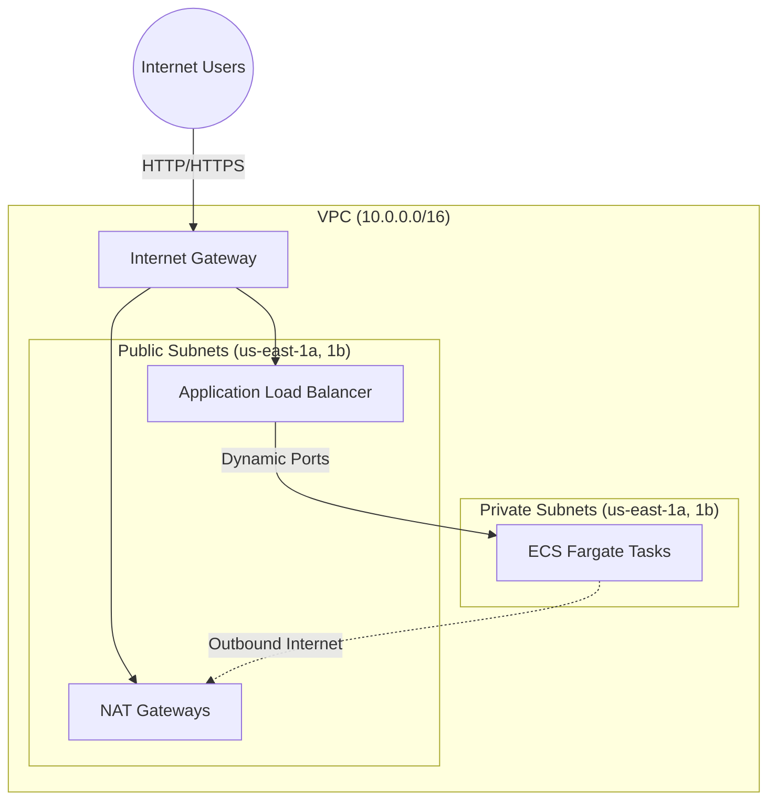

# AWS ECS Fargate Terraform Infrastructure

An industry-standard, modular Terraform project designed to provision a highly available AWS ECS Fargate application. The infrastructure is segmented into multiple isolated environments (`dev`, `staging`, `prod`) to enable safe progression and testing of infrastructure changes.

## Architecture

This project implements a secure, highly-available architecture across multiple Availability Zones. ECS Fargate Tasks run in private subnets, meaning they are completely hidden from the public internet. They receive inbound user traffic exclusively through an Application Load Balancer (ALB) and route outbound requests (e.g., pulling images from Docker/ECR) through a NAT Gateway.



## Directory Structure
The workspace is split into **Environments** and **Modules** to maximize code reusability and isolate state between deployments.

```text
.
├── environments/
│   ├── dev/       # Development-specific variable definitions and state
│   ├── staging/   # Staging-specific variable definitions and state
│   └── prod/      # Production-specific variable definitions and state
└── modules/
    ├── alb/           # Application Load Balancer, Target Groups, and Security Groups
    ├── ecs-cluster/   # Core ECS Cluster with Container Insights
    ├── ecs-service/   # Fargate Service, Task Definitions, and Container configurations
    ├── iam/           # Task Execution and Task Roles for ECS permissions
    └── network/       # High-availability VPC, Subnets, NAT Gateways, and Route Tables
```

## Modules Overview

- **`network/`**: Constructs a robust VPC framework. It provisions 2 public subnets for the load balancer and 2 private subnets for your Fargate compute. It also supplies the NAT gateways ensuring your private tasks maintain outbound internet access.
- **`alb/`**: Sets up the Application Load Balancer mapped directly to the public subnets. This serves as the single point of entry for your application.
- **`ecs-cluster/`**: Configures the underlying Amazon ECS Cluster namespace with CloudWatch Container Insights enabled out of the box for deep observability.
- **`ecs-service/`**: Defines the actual Docker container bindings, Fargate configuration (vCPU, Memory), and mounts the service to the Target Group of the ALB.
- **`iam/`**: Manages the execution role (required to pull Docker images) and the task role (required for the application itself to trigger AWS APIs).

## Getting Started

### Prerequisites
- [Terraform](https://developer.hashicorp.com/terraform/downloads) >= v1.5.0
- [AWS CLI](https://aws.amazon.com/cli/) configured with required permissions.

### Usage
To deploy a specific environment (e.g., `dev`):

1. **Navigate to environment directory:**
   ```bash
   cd environments/dev
   ```

2. **Initialize Terraform:**
   This downloads the necessary AWS providers and initializes the modules.
   ```bash
   terraform init
   ```

3. **Plan the infrastructure:**
   Review the changes before modifying any actual infrastructure.
   ```bash
   terraform plan
   ```

4. **Apply the changes:**
   Deploy the infrastructure components.
   ```bash
   terraform apply
   ```

### Managing the `environment` Variable
The `environment` variable is used to prefix resource names and tag items (e.g., `dev-ecs-task-role`). There are several ways to provide or override this value:

- **Folder-specific Defaults**: Each environment folder (`environments/dev`, `environments/prod`, etc.) already has a default value defined in its `variables.tf`.
- **Using `.tfvars` file (Recommended)**: Create or edit `terraform.tfvars` within the environment directory:
  ```hcl
  environment = "dev"
  ```
- **Command Line override**:
  ```bash
  terraform apply -var="environment=dev"
  ```
- **Environment Variable**:
  ```bash
  export TF_VAR_environment="dev"
  terraform apply
  ```
