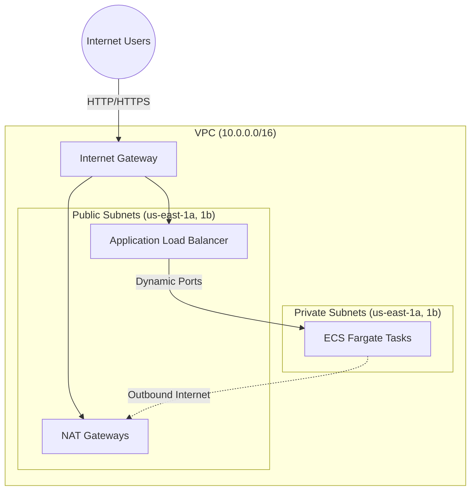

# AWS ECS Fargate Terraform Infrastructure

An industry-standard, modular Terraform project designed to provision a highly available AWS ECS Fargate application. The infrastructure is segmented into multiple isolated environments (`dev`, `staging`, `prod`) to enable safe progression and testing of infrastructure changes.

## Architecture

This project implements a secure, highly-available architecture across multiple Availability Zones. ECS Fargate Tasks run in private subnets, meaning they are completely hidden from the public internet. They receive inbound user traffic exclusively through an Application Load Balancer (ALB) and route outbound requests (e.g., pulling images from Docker/ECR) through a NAT Gateway.



## Directory Structure

The workspace is split into **Environments** and **Modules** to maximize code reusability and isolate state between deployments.

```text
.
├── environments/
│   ├── dev/       # Development-specific variable definitions and state
│   ├── staging/   # Staging-specific variable definitions and state
│   └── prod/      # Production-specific variable definitions and state
└── modules/
    ├── alb/           # Application Load Balancer, Target Groups, and Security Groups
    ├── ecs-cluster/   # Core ECS Cluster with Container Insights
    ├── ecs-service/   # Fargate Service, Task Definitions, and Container configurations
    ├── iam/           # Task Execution and Task Roles for ECS permissions
    └── network/       # High-availability VPC, Subnets, NAT Gateways, and Route Tables
```

## Modules Overview

- **`network/`**: Constructs a robust VPC framework. It provisions 2 public subnets for the load balancer and 2 private subnets for your Fargate compute. Supports a `single_nat_gateway` flag to reduce NAT costs in non-production environments.
- **`alb/`**: Sets up the Application Load Balancer mapped directly to the public subnets. This serves as the single point of entry for your application.
- **`ecs-cluster/`**: Configures the underlying Amazon ECS Cluster namespace with CloudWatch Container Insights enabled out of the box for deep observability.
- **`ecs-service/`**: Defines the actual Docker container bindings, Fargate configuration (vCPU, Memory), and mounts the service to the Target Group of the ALB. Supports configurable log retention and listener rule priority.
- **`iam/`**: Manages the execution role (required to pull Docker images) and the task role (required for the application itself to trigger AWS APIs).

## Key Design Decisions

| Decision | Detail |
|----------|--------|
| **Single NAT in dev/staging** | Dev and staging use one NAT Gateway across all AZs, saving ~$32/mo per removed gateway. Prod uses one per AZ for high availability. |
| **Provider `default_tags`** | `Environment` and `ManagedBy` tags are applied at the provider level — no duplication in individual resources. |
| **Configurable log retention** | Dev defaults to 7 days, staging to 14, prod to 30 — set via `log_retention_days` variable. |
| **Versioned modules** | Each module pins `required_version` and `required_providers` via `versions.tf` to prevent silent breaking changes. |
| **Remote state (S3)** | Backend config is present in each environment's `backend.tf` — uncomment and configure before team use. |

## Getting Started

### Prerequisites

- [Terraform](https://developer.hashicorp.com/terraform/downloads) >= v1.5.0
- [AWS CLI](https://aws.amazon.com/cli/) configured with required permissions

### Remote State Setup (Recommended Before Team Use)

Before enabling the S3 backend in `backend.tf`, create the required AWS resources:

```bash
# Create S3 bucket for state
aws s3api create-bucket --bucket YOUR-TERRAFORM-STATE-BUCKET --region us-east-1

# Enable versioning
aws s3api put-bucket-versioning \
  --bucket YOUR-TERRAFORM-STATE-BUCKET \
  --versioning-configuration Status=Enabled

# Enable encryption
aws s3api put-bucket-encryption \
  --bucket YOUR-TERRAFORM-STATE-BUCKET \
  --server-side-encryption-configuration \
  '{"Rules":[{"ApplyServerSideEncryptionByDefault":{"SSEAlgorithm":"AES256"}}]}'

# Create DynamoDB table for state locking
aws dynamodb create-table \
  --table-name terraform-lock-table \
  --attribute-definitions AttributeName=LockID,AttributeType=S \
  --key-schema AttributeName=LockID,KeyType=HASH \
  --billing-mode PAY_PER_REQUEST \
  --region us-east-1
```

Then uncomment the `backend "s3"` block in each environment's `backend.tf` and run `terraform init`.

For deployment, scaling, teardown, and other operational procedures, see [RUNBOOK.md](RUNBOOK.md).

### Configurable Variables per Environment

| Variable | Dev default | Staging default | Prod default | Description |
|----------|-------------|-----------------|--------------|-------------|
| `aws_region` | `us-east-1` | `us-east-1` | `us-east-1` | AWS region |
| `cluster_name` | `fargate-cluster` | `fargate-cluster` | `fargate-cluster` | ECS cluster name |
| `container_image` | `httpd:latest` | `httpd:latest` | `httpd:latest` | Docker image URI |
| `container_port` | `80` | `80` | `80` | Container port |
| `desired_count` | `2` | `2` | `3` | Number of tasks |
| `cpu` | `256` | `256` | `512` | Fargate CPU units |
| `memory` | `512` | `512` | `1024` | Fargate memory (MB) |
| `log_retention_days` | `7` | `14` | `30` | CloudWatch log retention |
| `listener_rule_priority` | `100` | `100` | `100` | ALB listener rule priority |

## Cost Estimation

> Estimates based on **us-east-1** pricing (March 2026). Assumes 730 hours/month and light traffic (~50 GB data transfer through NAT). Actual costs depend on task count, traffic, and data volume.

### Dev Environment

| Resource | Quantity | Unit Price | Monthly Cost |
|----------|----------|------------|--------------|
| NAT Gateway (single) | 1 | $0.045/hr | $32.85 |
| NAT Gateway data (est. 50 GB) | 50 GB | $0.045/GB | $2.25 |
| Application Load Balancer | 1 | $0.0225/hr | $16.43 |
| ALB LCU (est. light traffic) | — | — | ~$3.00 |
| ECS Fargate vCPU (2 tasks × 0.25 vCPU) | 365 vCPU-hr | $0.04048/hr | $14.78 |
| ECS Fargate memory (2 tasks × 0.5 GB) | 730 GB-hr | $0.004445/hr | $3.25 |
| CloudWatch Logs (est. 5 GB ingested) | 5 GB | $0.50/GB | $2.50 |
| **Total** | | | **~$75/mo** |

### Staging Environment

| Resource | Quantity | Unit Price | Monthly Cost |
|----------|----------|------------|--------------|
| NAT Gateway (single) | 1 | $0.045/hr | $32.85 |
| NAT Gateway data (est. 50 GB) | 50 GB | $0.045/GB | $2.25 |
| Application Load Balancer | 1 | $0.0225/hr | $16.43 |
| ALB LCU (est. light traffic) | — | — | ~$3.00 |
| ECS Fargate vCPU (2 tasks × 0.25 vCPU) | 365 vCPU-hr | $0.04048/hr | $14.78 |
| ECS Fargate memory (2 tasks × 0.5 GB) | 730 GB-hr | $0.004445/hr | $3.25 |
| CloudWatch Logs (est. 5 GB ingested) | 5 GB | $0.50/GB | $2.50 |
| **Total** | | | **~$75/mo** |

### Prod Environment

| Resource | Quantity | Unit Price | Monthly Cost |
|----------|----------|------------|--------------|
| NAT Gateway (one per AZ × 2) | 2 | $0.045/hr | $65.70 |
| NAT Gateway data (est. 200 GB) | 200 GB | $0.045/GB | $9.00 |
| Application Load Balancer | 1 | $0.0225/hr | $16.43 |
| ALB LCU (est. moderate traffic) | — | — | ~$10.00 |
| ECS Fargate vCPU (3 tasks × 0.5 vCPU) | 1,095 vCPU-hr | $0.04048/hr | $44.33 |
| ECS Fargate memory (3 tasks × 1 GB) | 2,190 GB-hr | $0.004445/hr | $9.73 |
| CloudWatch Logs (est. 20 GB ingested) | 20 GB | $0.50/GB | $10.00 |
| **Total** | | | **~$165/mo** |

### Cost Saving Tips

- **Use Fargate Spot** for dev/staging: up to 70% discount on Fargate compute by adding `capacity_provider_strategy` to the ECS service.
- **Scale to zero at night**: use scheduled scaling (Application Auto Scaling) to set `desired_count = 0` outside business hours in dev.
- **Rightsize tasks**: the default 256 CPU / 512 MB is the smallest Fargate unit. Increase only when metrics show sustained CPU/memory pressure.
- **Reserved NAT data**: most NAT costs come from data processing. Minimize by using VPC endpoints for S3, ECR, and CloudWatch to avoid routing through the NAT.

## Compute Strategy: Fargate vs EC2 vs Fargate Spot

This section explains the three compute options available for ECS and when to use each, based on the cost and operational characteristics of this project.

### How ECS compute works

The `aws_ecs_cluster` resource is a **logical namespace only** — it has no compute attached. What determines where your containers actually run is declared in the ECS Service and Task Definition inside `modules/ecs-service/main.tf`:

```hcl
# Task Definition — declares Fargate as required
requires_compatibilities = ["FARGATE"]
network_mode             = "awsvpc"

# ECS Service — launches tasks on Fargate
launch_type = "FARGATE"
```

You can switch compute strategies by changing these two blocks. No changes to the cluster, VPC, or ALB are needed.

---

### Option 1: Fargate (current)

AWS provisions a micro-VM for each task. You never see or manage the underlying host.

**How it works:**
- You define CPU units and memory in the Task Definition
- AWS finds capacity, starts your container, and keeps it running
- If a task crashes, ECS automatically replaces it
- Tasks run 24/7 — they are not event-driven (unlike Lambda)

**This is not Lambda.** Fargate is a long-running container (like a traditional server process). Lambda is a short-lived function that exits after handling one event. Fargate is appropriate for web APIs, background workers, and microservices that need to be always-on.

**Cost (us-east-1, 730 hrs/month):**

| Environment | Tasks | vCPU | Memory | Monthly compute |
|-------------|-------|------|--------|----------------|
| Dev | 2 | 0.25 each | 512 MB each | ~$18 |
| Staging | 2 | 0.25 each | 512 MB each | ~$18 |
| Prod | 3 | 0.5 each | 1 GB each | ~$54 |

Pricing rates: `$0.04048/vCPU-hr` + `$0.004445/GB-hr`

**Pros:** Zero infrastructure management, no patching, scales per-task, HA by default.
**Cons:** More expensive than EC2 for large sustained workloads.

---

### Option 2: EC2 launch type

You provision EC2 instances that register as ECS Container Instances. ECS schedules tasks onto them.

**How it works:**
- You create an Auto Scaling Group of EC2 instances with the ECS-optimized AMI
- The ECS agent runs on each instance and reports available CPU/memory
- ECS bins-packs tasks onto instances
- You are responsible for: instance patching, ECS agent updates, ASG scaling policies, and capacity planning

**Minimum instance sizes for this project:**

| Environment | Total needed (tasks + agent overhead) | Recommended instance | On-Demand/mo |
|-------------|--------------------------------------|---------------------|-------------|
| Dev/Staging | ~0.6 vCPU, ~1.1 GB | t3.small (2 vCPU, 2 GB) | $15 |
| Prod | ~1.6 vCPU, ~3.1 GB | t3.medium (2 vCPU, 4 GB) or 2× t3.small | $30 |

**Cost comparison vs Fargate:**

| | Fargate | EC2 on-demand | EC2 1yr reserved |
|--|---------|--------------|-----------------|
| Dev compute | $18/mo | $15/mo | ~$9/mo |
| Prod compute | $54/mo | $30/mo | ~$18/mo |
| Manage OS/patching | No | Yes | Yes |
| Requires ASG + Launch Template | No | Yes | Yes |

**Verdict:** EC2 saves $3–9/mo in dev (not worth the overhead) and $24–36/mo in prod (worth considering if you have DevOps capacity to manage it). For most teams running this project, the operational cost of managing EC2 instances outweighs the savings at this task scale.

**Additional Terraform required for EC2 mode:**
```hcl
# You would need to add to environments/<env>/main.tf:
resource "aws_autoscaling_group" "ecs" { ... }
resource "aws_launch_template" "ecs" { ... }
resource "aws_ecs_capacity_provider" "ec2" { ... }
```

---

### Option 3: Fargate Spot (recommended for dev/staging)

Fargate Spot runs your tasks on spare AWS capacity at up to **70% discount**. AWS may reclaim tasks with a 2-minute warning when it needs capacity back (rare in practice).

**How it works:**
- Identical to standard Fargate — no infrastructure to manage
- AWS sends a `SIGTERM` to your container 2 minutes before reclaiming it
- ECS automatically replaces interrupted tasks
- Best used alongside at least 1 standard Fargate task in prod for guaranteed availability

**Cost comparison:**

| Environment | Standard Fargate | Fargate Spot | Saving |
|-------------|-----------------|-------------|--------|
| Dev compute | $18/mo | ~$5/mo | ~$13/mo |
| Staging compute | $18/mo | ~$5/mo | ~$13/mo |
| Prod compute | $54/mo | ~$16/mo | ~$38/mo |

**To enable Fargate Spot**, replace `launch_type` in `modules/ecs-service/main.tf` with a capacity provider strategy:

```hcl
# Remove this:
# launch_type = "FARGATE"

# Add this (100% Spot — suitable for dev/staging):
capacity_provider_strategy {
  capacity_provider = "FARGATE_SPOT"
  weight            = 1
}
```

For **prod**, use a mixed strategy to guarantee at least one task survives a Spot reclamation:

```hcl
# 1 task always on standard Fargate, rest on Spot:
capacity_provider_strategy {
  capacity_provider = "FARGATE"
  weight            = 1
  base              = 1
}

capacity_provider_strategy {
  capacity_provider = "FARGATE_SPOT"
  weight            = 3
}
```

**Important:** When using `capacity_provider_strategy`, the cluster must have the providers enabled. Add this to `modules/ecs-cluster/main.tf`:

```hcl
resource "aws_ecs_cluster_capacity_providers" "main" {
  cluster_name       = aws_ecs_cluster.main.name
  capacity_providers = ["FARGATE", "FARGATE_SPOT"]
}
```

---

### Decision guide

```
Are you running dev or staging?
  └── Yes → Use Fargate Spot (70% cheaper, zero management)

Are you running prod?
  ├── Small scale (< 5 tasks) → Use Fargate or mixed Fargate + Spot
  ├── Medium scale (5–20 tasks) → Evaluate mixed Spot strategy
  └── Large scale (20+ tasks, sustained) → Consider EC2 with reserved instances

Do you have time to manage EC2 instances, patching, and ASG tuning?
  └── No → Stay on Fargate or Fargate Spot regardless of environment
```

## How to Read This Codebase

### Mental model: Modules are functions

Each Terraform module works like a **function call**. The environment file is the caller, and each module folder contains the parameters, logic, and return values.

| Programming concept | Terraform equivalent |
|---|---|
| Function call | `module "network" { ... }` in `environments/<env>/main.tf` |
| Arguments | Key-value pairs inside the module block (e.g., `vpc_cidr = var.vpc_cidr`) |
| Parameters | `modules/<name>/variables.tf` — what the module accepts |
| Function body | `modules/<name>/main.tf` — what it actually creates |
| Return values | `modules/<name>/outputs.tf` — what it exposes back to the caller |
| Using return values | `module.network.vpc_id` referenced in other module blocks |

### Reading pattern

Always read in this order:

```
environments/<env>/main.tf      ← Start here (the caller)
        │
        ▼
modules/<name>/variables.tf     ← What inputs does it accept?
        │
        ▼
modules/<name>/main.tf          ← What AWS resources does it create?
        │
        ▼
modules/<name>/outputs.tf       ← What does it return to the caller?
```

### Entry point

The entry point is always an **environment directory** (e.g., `environments/dev/main.tf`). It calls all modules and wires them together by passing outputs from one module as inputs to the next.

### Example: Tracing a value through the network module

Follow `vpc_cidr` from definition to usage:

```
var.vpc_cidr = "10.0.0.0/16"                     # defined in environments/dev/variables.tf
        │
        ▼
module "network" {
  vpc_cidr = var.vpc_cidr                         # passed as input (environments/dev/main.tf)
}
        │
        ▼
variable "vpc_cidr" { }                           # received in modules/network/variables.tf
        │
        ▼
resource "aws_vpc" "main" {
  cidr_block = var.vpc_cidr                       # used to create a real VPC (network/main.tf)
}
        │
        ▼
output "vpc_id" {
  value = aws_vpc.main.id                         # VPC id exposed back (network/outputs.tf)
}
        │
        ▼
module "alb" {
  vpc_id = module.network.vpc_id                  # consumed by the ALB module (environments/dev/main.tf)
}
```

### How modules connect

```
environments/dev/main.tf
    │
    ├── module "network"        → creates VPC, subnets
    │       outputs: vpc_id, public_subnets, private_subnets
    │           │
    │           ├──────────────────────────────────┐
    │           ▼                                  ▼
    ├── module "alb"            → uses vpc_id,     │
    │       outputs: listener_arn,                 │
    │                security_group_id             │
    │           │                                  │
    ├── module "iam"            → creates roles    │
    │       outputs: execution_role_arn,           │
    │                task_role_arn                  │
    │           │                                  │
    ├── module "ecs_cluster"    → creates cluster  │
    │       outputs: cluster_id                    │
    │           │                                  │
    │           ▼                                  ▼
    └── module "ecs_service"    ← consumes outputs from ALL above modules
```

The `ecs_service` module is the final consumer — it needs the VPC, subnets, ALB listener, IAM roles, and cluster ID to run containers.
